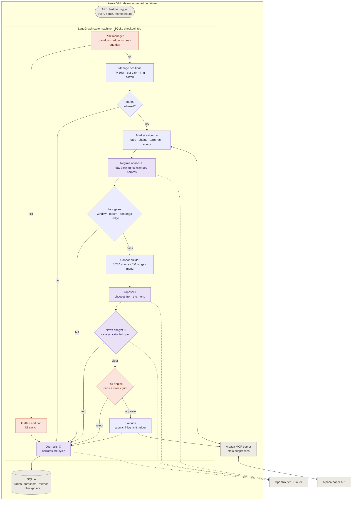

# HedgeMePlease

**An autonomous iron condor desk, run by AI agents, governed by arithmetic.**

Built for the Alpaca AI Trading Agents Hackathon. A LangGraph state machine wakes every five minutes of the contest window, harvests the one options edge with decades of peer-reviewed evidence behind it — the volatility risk premium — and lets a team of four LLM agents inform, choose, veto, and narrate while a deterministic risk engine holds the only set of keys. Every quote, bar, chain, and order flows through the **official Alpaca MCP server**. Every decision, taken or refused, is written down.

    

---

## The thesis in one sentence

We do not predict direction: we sell defined-risk iron condors on SPY and QQQ only when the market is measurably overpaying for movement — implied volatility at least 1.15 times our own HAR-RV forecast of realized volatility — and we make the worst case a number we chose in advance.

## The pipeline

One invocation of the graph is one five minute cycle. Purple nodes are LLM agents (fail-open, never authoritative). The risk engine holds the only unconditional veto.



## Why this strategy

| Claim | Evidence |
|---|---|
| Implied vol systematically exceeds realized (~84% of days, ~4 vol pts) | Bakshi & Kapadia (RFS 2003); Carr & Wu (RFS 2009); CBOE put-write index studies (Bondarenko) |
| Passive condor selling died post-2010; regime gating is required | CBOE CNDR index: +9.1% CAGR 1987–2010, negative since |
| Term-structure inversion precedes vol disasters | Simon & Campasano (J. Derivatives 2014); contango holds ~80–85% of days |
| HAR-RV is the standard, hard-to-beat realized vol forecaster | Corsi (2009); Federal Reserve FEDS study: ML shows no consistent edge over it |
| Manage winners early, defined risk only, exit before expiry | Practitioner research on 50% profit-taking; OptionSellers/XIV as the cautionary tails |

## The agent desk

| Agent | Power | Failure mode |
|---|---|---|
| Regime analyst | Tunes edge ratio, delta target, size factor — **inside hard clamps** | Deterministic defaults |
| Proposer | Picks one condor from a pre-validated menu | First (best credit/width) candidate |
| News analyst | Vetoes an approved entry over concrete catalysts | No veto |
| Journalist | Narrates every cycle into the audit trail | Structured log only |

Agents can **subtract risk or add context — never add risk**. No agent can loosen a cap, size past the clamps, or overrule the stress grid. No key configured? The desk degrades to a fully deterministic bot and keeps trading.

## The risk engine (the part that is not allowed to be clever)

| Limit | Value |
|---|---|
| Kill switch — cancel all, flatten all, halt (sticky) | −3.5% from peak equity |
| Daily ladder | −1.0% no new trades · −1.5% reduce only |
| De-risk sizing ladder | 50% of kill budget spent → half size · 75% → no entries |
| Per position max loss | $500 target, $1,000 hard cap |
| Whole book stress grid (spot ±5% × vol shocked up) | worst cell ≥ −$2,500 |
| Concentration | ≤6 positions, ≤2 per underlying, sleeve budget $1,500 |
| Naked options | banned — structurally impossible (atomic 4-leg orders only) |
| Contest end | flat by Thu 15:30 ET; the mark is Thursday EOD |

The stress grid revalues every leg under crossed spot and vol shocks with an in-house Black-Scholes engine before any entry. Both prices come from the same model, so model error cancels — only the difference is trusted.

## Execution discipline

Atomic multi-leg limit orders only (leg risk cannot exist). Post at the net-credit mid, concede two cents at 40 second intervals at most twice, never below the 12%-of-width credit floor, then confirmed-cancel and walk away. Stale intentions die; the next cycle re-decides from scratch. Partial fills are kept — every filled unit is a complete defined-risk condor.

## Quickstart

```bash
git clone https://github.com/alpacahq/alpaca-mcp-server ../alpaca-mcp-server
uv sync --dev
cp .env.example .env    # Alpaca paper keys + optional OpenRouter key
uv run pytest           # 63 tests, all offline, no keys needed
```

| Command | What it does |
|---|---|
| `uv run alpacha status` | account, book, drawdown state |
| `uv run alpacha rv SPY` | RV series, HAR forecast, walk-forward vs baselines |
| `uv run alpacha preview SPY` | chain → candidates → risk verdict, no orders |
| `uv run alpacha scan` | one full **dry-run** graph cycle |
| `uv run alpacha once` | one live cycle (places orders) |
| `uv run alpacha loop` | the daemon, until contest end |
| `uv run alpacha flatten` / `panic` / `unhalt` | manual overrides |
| `uv run alpacha memos` | tail the audit trail |

## Tested like we mean it

Every component has offline tests with zero network and zero keys: the pricing engine (put-call parity, intrinsic limits), the stress grid (tail losses bounded by wing width), the risk engine (every rung of the ladder), the vol pipeline (incomplete days excluded — annualizing a partial day would bias the edge gate), the HAR model (walk-forward against dumb baselines, demotion rules), the gates (contest calendar blackouts included), the condor builder (credit floors, delta bands, loss caps), the executor ladder (floor-respecting concessions, confirmed cancels, partial fills), and — the capstone — **the full LangGraph cycle running end to end against a fake broker**, from trigger to journaled dry-run execution, plus the kill-switch path proving a breach halts and flattens.

## Design principles

1. **Two brains, strict hierarchy.** Everything that decides money is deterministic code with hard numbers. Models inform; arithmetic decides.
2. **Every failure has a chosen direction.** Data gates fail closed. LLM agents fail open. Execution fails passive. Each default answers: which mistake is cheaper?
3. **The account never holds anything the ledger cannot explain.** Reconciliation runs every cycle; unknowns raise alerts, never guesses.
4. **Not trading is a position.** At VIX ~14 the edge gate is tight by design. Quiet cycles are the system working.

## Contest disclosure

Per the hackathon FAQ, pre-window work is disclosed: strategy research, architecture design, and scaffolding were prepared before the scoring window; the official 100,000 paper account trades only within the window (Mon Aug 31 09:30 ET → equity marked EOD Thu Sep 3). Backtest-style validation here is limited to walk-forward forecaster evaluation; official P&L is the live paper account.

Built with the official [Alpaca MCP server](https://github.com/alpacahq/alpaca-mcp-server), [LangGraph](https://github.com/langchain-ai/langgraph), and Claude via OpenRouter.
